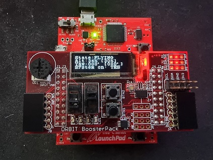

# ENCE464 - Embedded Software & Advanced Computer Project - Term-3
```
University of Canterbury
ENCE464 - Embedded Software & Advanced Computer Project - Term-3
2 September 2021.
```

Helirig controller programmed for a Tiva C Series TM4C123GH6PM microcontroller using FreeRTOS.

## Prerequisites
CCS Project configured so that our files can be dropped in directly, including OrbitOLED as there is a custom character for displaying yaw in degrees. 
- ENSURE CCS PROJECT HEAP SIZE IS CONFIGURED IN PROJECT SETTINGS. Otherwise tasks such as circular buffer will not function correctly when calling calloc.

### OLED display format
The following Status information is displayed on the OLED display:
- System state
- Current altitude percentage, target altitude percentage
- Current yaw in degrees, target yaw in degrees
- System mode: directly displays right switch current logic state



### Flying the helicopter
- Move the right switch on the Tiva to the `ON` position, then press the `UP` button to initiate the calibration state.

- The helicopter should rotate until yaw is calibrated, then switch into flight mode and climb to 10% altitude. User input to adjust height and rotation should now be possible.

- If the target altitude is adjusted to under 10%, the helicopter should enter the landing state, land and return to the starting idle state.

- Flight can begin again by pressing the `UP` button.

- If the switch is moved back to the `OFF` position while in takeoff or flying states, the helicopter will transition to the landing state.


### Testing Note:

Unfortunately due to the 2021 COVID lockdown, overall system functionality testing was not possible and flight capability has not been tested. Minimal testing of individual PWM outputs and generation of quadrature encoder signal input was carried out using an Arduino Nano, however this was unreliable and provided insufficient evidence that this Helirig controller performs as intended.


